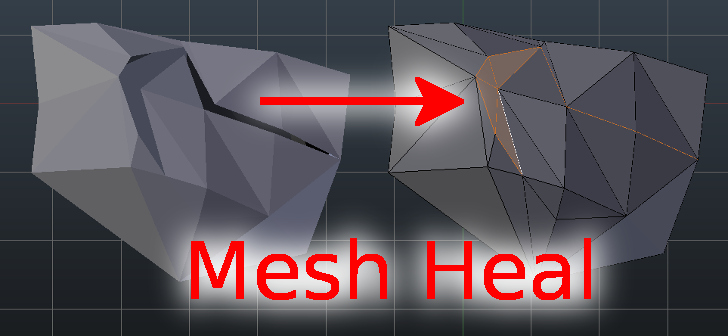

# Mesh Heal add-on for Blender

## Introduction

Mesh Heal is an add-on for [Blender](https://www.blender.org/). It
includes additional Blender operators for healing surface meshes. By
default, Blender contains many routines that are meant for these
tasks. Unfortunately, Blender’s default routines don’t always produce
good results in some difficult cases. Specifically, I run into
problems when I was trying to convert non-manifold isosurfaces into
manifold surfaces with consistent face normals appropriate for
volumetric rendering.

## Documentation

Documentation (made using [Sphinx](https://www.sphinx-doc.org/en/master/))
is located in docs directory of the sources and is viewable online at
https://mesh_heal.readthedocs.io.

## Feedback

[Please report issues at github](https://github.com/tkeskita/mesh_heal/issues)  
