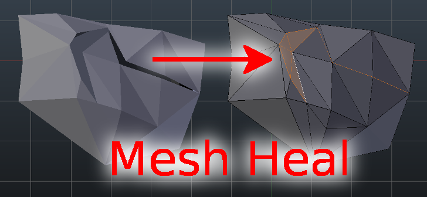

Mesh Heal add-on documentation
==============================

Introduction
------------

Mesh Heal is an add-on for `Blender <https://www.blender.org/>`_. It
includes additional Blender operators for healing polygon surface meshes. By
default, Blender contains many routines that are meant for these
tasks, e.g. tools in the *3D-Print Toolbox* add-on.
Unfortunately, Blender's default routines don't always produce
good results in some difficult cases. Specifically, I run into
problems when I was trying to convert non-manifold `isosurfaces
<https://en.wikipedia.org/wiki/Isosurface>`_ into `manifold
<https://en.wikipedia.org/wiki/Manifold>`_ surfaces with consistent
face normals appropriate for volumetric rendering.

Warnings
--------

* Mesh Heal operators are experimental, use at your own risk.
* Mesh Heal operators are slow on large meshes.
* Supported on newest LTS release of Blender (currently 3.6), but
  should work on any Blender version starting from 2.83.

Recommendations
---------------

First try to use Blender's default routines to heal your
mesh. Especially, please check `the official 3D Print Toolbox add-on
<https://docs.blender.org/manual/en/latest/addons/mesh/3d_print_toolbox.html>`_,
which contains many mesh healing and analysis operators. If Blender's
default operators fail, try this add-on.

Installation
------------

* Source code is available in https://github.com/tkeskita/mesh_heal
  --> Code --> Download zip.
* Start Blender, go to "Preferences" --> Add-ons --> Install from File
  --> open the downloaded zip file.
* Activate the "Mesh Heal add-on" in Preferences.
  It is located in "Community" level of Blender add-ons.
	  
  .. note::
     Enabling Mesh Heal add-on will also enable 3D Print
     Toolbox add-on (which is a requirement for Mesh Heal add-on).

Usage
-----

Mesh Heal (MH) add-on tools are currently available in object
mode. Tools are located in "Mesh Heal" tab in the Sidebar.

.. image:: images/mesh_heal_tab.png

All operators are available in object mode (and some in edit mode as
well). Operators are listed in operator search menu prepended with
"MH".
   
Simple Clean
^^^^^^^^^^^^

This is a convenience operator, which combines several cleaning actions:

* Merges closeby vertices using the distance value set in the operator panel
* Runs the Delete Overlapping Neighbor Faces operator  
* Removes non-manifold vertices (not boundary vertices), edges and faces
* Deletes edges and vertices that are not part of faces

Delete Overlapping Neighbor Faces
^^^^^^^^^^^^^^^^^^^^^^^^^^^^^^^^^

Deletes overlapping neighbor faces and removes dangling edges and
vertices. Neighbor faces mean faces that share an edge.  Overlapping
is determined by face-face angle measured at the shared edge.
Primarily the face with fewer vertices is deleted. If number of
vertices are identical, then smaller face is deleted.

Sew Mesh
^^^^^^^^

Reduces number of boundary edges in mesh by merging pairs of closeby 
boundary vertices (sew open seams). Boundary vertices are merged 
if ratio of vertex pair distance to smallest boundary edge length
(of edges connected to either vertex) is smaller than threshold.

.. image:: images/mesh_heal_sew.png

Triangulate Twisted Faces
^^^^^^^^^^^^^^^^^^^^^^^^^

Splits twisted faces into triangular faces. Twist is determined by the
angle between face normal and vertex vectors. Vertex vector is the
vector from face median center point to a face vertex. Angles of all
vertex vectors are checked, and the maximum angle is compared agains
given angle parameter. If maximum angle exceeds parameter value, then
the face is split into triangles and added to current face
selection.

Clean and Patch
^^^^^^^^^^^^^^^

Main mesh cleaning routine. This routine attempts 
(but does not guarantee) to make closed volumes by
merging vertices, then repeatedly removing bad faces and 
refilling boundary holes left in the mesh.
Bad faces are made of vertices, which are either boundary vertices,
or vertices of intersecting or overlapping faces.

Fill Holes (Sharp)
^^^^^^^^^^^^^^^^^^

Fills boundary edges in object obj with triangles by a 'sharpest angle
first' approach. This method processes each continuous boundary edge
loop and fills it with triangles by connecting two neighboring
boundary edges. Connections are done in vertex angle sharpness order,
so that a face is filled to the vertex whose boundary edges form
shapest angle. Connection is not made if it would create intersecting
faces. Triangle filling is repeated until all boundary edges that can
be processed, have been processed.

MH Recalc Norms
^^^^^^^^^^^^^^^

Recalculates normals of object using a recursive outward face normal
casting and propagation method (see below).

This operator works best on closed surfaces, but can be run on
non-manifold meshes as well. Algorithm also supports layers of
surfaces inside surfaces, in which case each surface layer normals are
set to opposite direction of outer layer normals. Faces whose normals
could not be calculated are added to selection when operator is
finished.

This Cycles volumetric emission shader example below shows how normal
direction affects the rendering result. The normals of the inner
surfaces are corrected by this operator.

Description of the algorithm:

Normal calculation algorithm contains alternating ray casting and
propagation phases. In casting phase, rays are cast from each
unprocessed face to both current normal and opposite directions. If
possible, normal information is set depending on what the rays hit
(e.g. world boundary, or a face with confirmed normal direction) and
the face is marked as processed. The method relies on getting correct
results from the casting phase. Therefore a few heuristics (search for
overlapping and high aspect ration faces) are included to choose which
faces are not included in casting.

In propagation phase, the normal direction is propagated from
processed faces to neighboring faces iteratively until all faces have
been processed. The casting and propagation phases are repeated until
all faces are processed.

Feedback
^^^^^^^^

`Please report issues at GitHub <https://github.com/tkeskita/mesh_heal/issues>`_

If you like this add-on, please star the project in GitHub!
